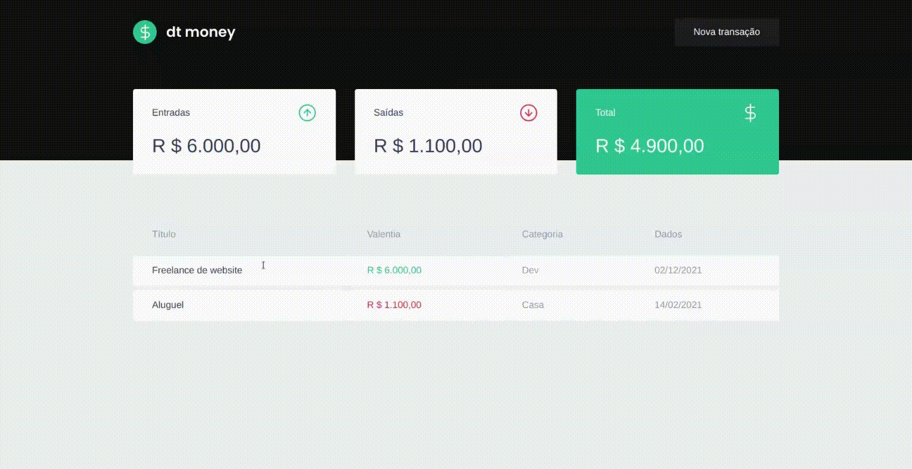

<h1 align="center">
  Rocketseat - Ignite - Chapter II
</h1>

<p align="center">
  <a href="#-about-the-project">Sobre o projeto</a>&nbsp;&nbsp;&nbsp;|&nbsp;&nbsp;&nbsp;
  <a href="#-technologies">Tecnologias</a>&nbsp;&nbsp;&nbsp;|&nbsp;&nbsp;&nbsp;
  <a href="#-getting-started">Instalação e uso</a>&nbsp;&nbsp;&nbsp;|&nbsp;&nbsp;&nbsp;
  <a href="#-license">License</a>
</p>


---

## 👨🏻‍💻 Sobre o projeto

O dt money é uma alternativa simples e eficaz para gerenciar suas finanças, permitindo o cadastro de entradas, saídas e a organização das mesmas em categorias.

---

## 🚀 Tecnologias

Tecnologias e ferramentas utilizadas no desenvolvimento do projeto:

- [ReactJS](https://reactjs.org/)
- [React Router DOM](https://reacttraining.com/react-router/)
- [Context API](https://reactjs.org/docs/context.html)
- [Styled Components](https://styled-components.com/)
- [Polished](https://github.com/styled-components/polished)
- [Axios](https://github.com/axios/axios)
- [Miragejs](https://miragejs.com/tutorial/intro/)

---

## 💻 Instalação e uso

**Clone o projeto e acesse a pasta**

```bash
# $ git clone https://github.com/jaquelinepires/ignite-chapter-II.git && cd jpmoney
```

**Siga os passos abaixo**

```bash
# Install the dependencies
$ yarn

# Start the client
$ yarn start
```

## 📝 License

---

<a href="https://opensource.org/licenses/MIT">
    
</a>
<br>
<br>
Esse projeto está sob a licença MIT.

---

Feito com ♥ by Jaqueline Pires
